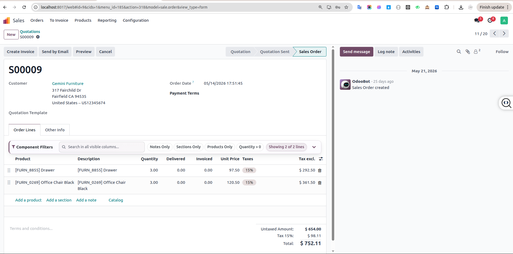
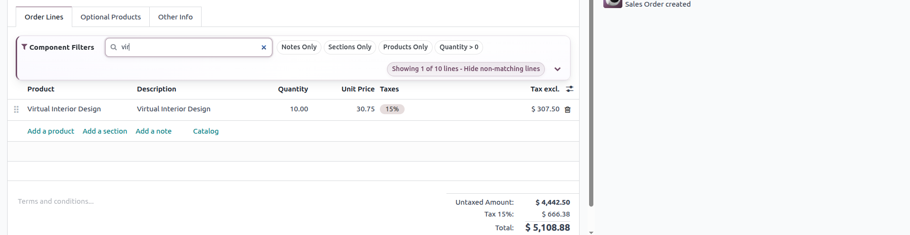
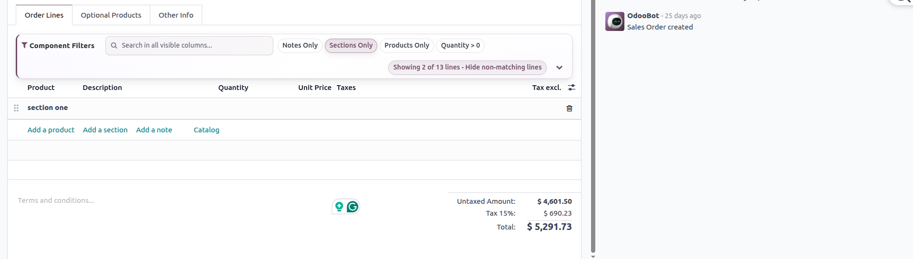
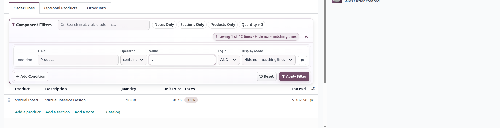
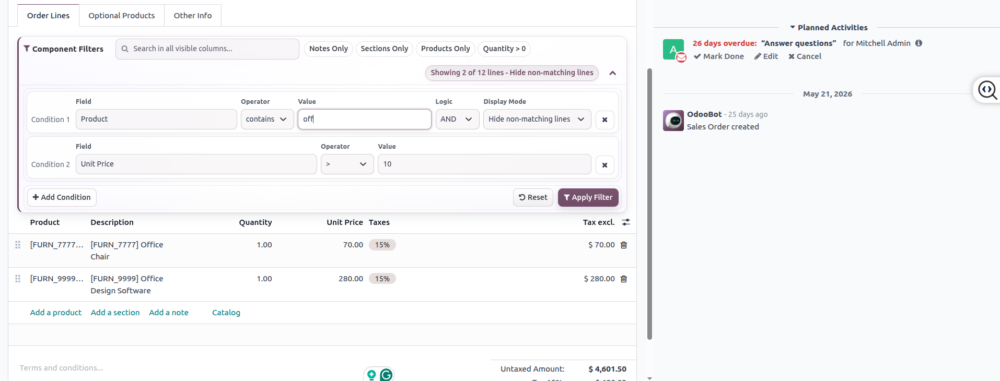
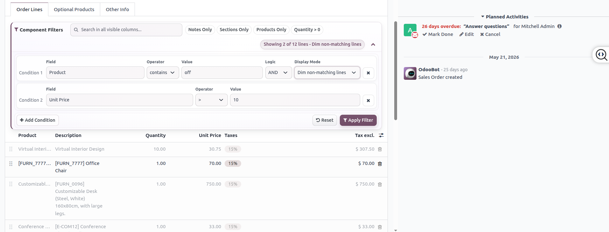
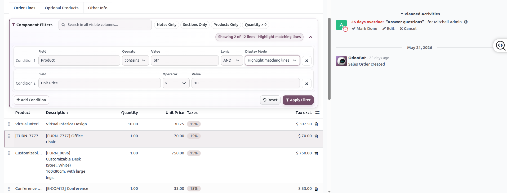
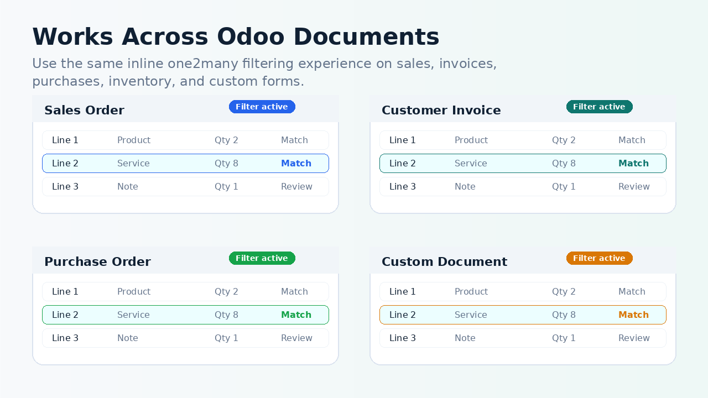

# One2many Advanced Filter

## Overview

One2many Advanced Filter adds powerful inline search and filtering directly inside Odoo one2many list views. It helps users work faster with large embedded line tables such as invoice lines, sale order lines, purchase order lines, inventory lines, and custom document lines.

The module lets users filter, search, highlight, and focus on relevant rows without leaving the parent form, opening a separate wizard, or changing the underlying business data.

Developed by **DevOdooX**.

## Features

- Inline one2many filtering inside the parent form
- Quick search across visible line content
- Multi-field filtering based on available one2many columns
- Multiple operators including contains, equals, not equals, greater than, less than, starts with, and more
- Filter by product, notes, sessions, or custom fields
- Highlight matching rows while keeping all lines visible
- Show only matching rows for focused review
- Compact filter panel designed for Odoo backend forms
- Sticky and clean user interface for long documents
- Works with standard Odoo forms and custom one2many implementations

## Installation

1. Copy `custom_one2many_advanced_filter` into your Odoo custom addons directory.
2. Restart the Odoo server.
3. Activate Developer Mode.
4. Go to **Apps**.
5. Click **Update Apps List**.
6. Search for **One2many Advanced Filter**.
7. Install the module.

No additional Python dependency is required.

## Configuration

No functional configuration is required after installation.

The module loads its frontend assets through `web.assets_backend` and automatically enhances supported one2many list views in the Odoo backend.

## Usage

1. Open a document that contains one2many lines, such as a sale order, invoice, purchase order, inventory document, or custom form.
2. Use the inline filter panel inside the one2many line area.
3. Enter a quick search term or select a field, operator, and value.
4. Choose whether to highlight matching rows or show only matching rows.
5. Clear the filter to return to the full line table.

Filtering is display-only. It does not create, update, delete, or save records.

## Screenshots

## Support

For support, implementation help, or customization requests, contact DevOdooX.

- Support Email: [devodoox06@gmail.com](mailto:devodoox06@gmail.com)
- LinkedIn: DevOdooX
- YouTube: DevOdooX
- Custom Development Available
- Module Customization Available

## Compatibility

- Odoo 17
- Odoo 18
- Odoo 19

## Contact Information

**Company:** DevOdooX  
**Support Email:** [devodoox06@gmail.com](mailto:devodoox06@gmail.com)  
**Module:** One2many Advanced Filter  
**Technical Name:** `custom_one2many_advanced_filter`  
**License:** LGPL-3
